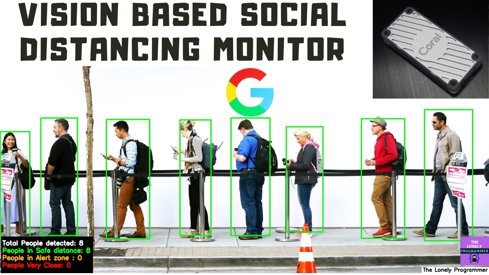
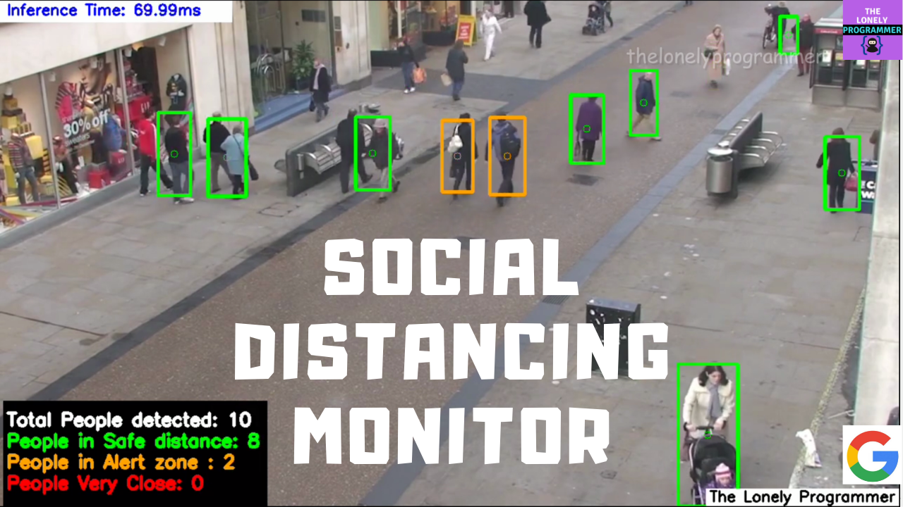

# Social Distancing Monitor at Edge using Deep Learning Computer Vision Tutorial

This project proposes to implement a computer vision-based social distancing detector.

## Why Did We Build This?

COVID-19 has been a major threat of 2020. It has been six months and the researchers are working hard to develop the vaccines for this virus. We are bound to reduce the spread of this virus in order to win this pandemic. So, it is our responsibility to wash our hands and follow social distancing practices. Although we try to follow social distancing, some people are not responsible to maintain distance or stand away from the neighboring person.



Maintain at least 1 metre (3 feet) distance between yourself and others. Why? When someone coughs, sneezes, or speaks they spray small liquid droplets from their nose or mouth which may contain virus. If you are too close, you can breathe in the droplets, including the COVID-19 virus if the person has the disease.

To avoid getting infected or spreading it, It is essential to maintain social distancing while going out from home especially to public places such as markets or hospitals.

## Idea and Working Prototype💡

The system is designed to detect the people from the Camera or Video feed and to determine the distance between the humans to classify whether they maintain social distancing or not. Using the above data, we can decide how to take countermeasures if they do not follow frequently. This project can be used in the hospital, market, bus terminals, restaurants, and other public gatherings where the monitoring has to be done.

This project consists of a camera that will capture the image of the people entering public places and measure social distancing among them using the distance features.

To test the real-time scenario, we have fed the video stream to the system to test how possibly it could be used and the results were pretty affirmative.

### Project Demo/Output 👇 Click on the image

[](https://youtu.be/RaJa4DdHlXE "Working of the Project - Click to Watch!")

### Video Tutorial + Improved Accuracy Output 👇 Click on the image

[](https://youtu.be/ESLQweINT_Q "Video Tutorial - Click to Watch!")

---

## Introduction 🧐
This tutorial explains the usage of Google Coral Accelerator to detect people present in the frame and calculating the distance between them. Assuming that you have already set up the Raspberry Pi with Raspbian OS, I'll be covering the following.

* Parts used and its specification
* Deploying a Tensorflow Lite Object detection Model to the Raspberry Pi
* Applying the Inference to the video stream
* Accelerate inferences of the TensorFlow Lite model with Google Coral Edge TPU Accelerator and Edge TPU Compiler.

The Overall components used for this project are shown below


## Hardware Build

One of the recently expanding markets is the Edge AI device. Edge devices are the co-processors used to process AI implementation. Some of the popular edge devices are Intel's Neural Compute Stick and Google Coral Accelerator. These help us to run inference on an edge device without sending the data to the cloud.

**The Kit**


**Inside the Box**


## Getting Started with Google Coral Accelerator

The Coral USB Accelerator is a USB device that provides an Edge TPU as a co-processor for your computer. It accelerates inferencing for your machine learning models when attached to either a Linux, Mac, or Windows host computer. The dimension of the Coral USB Accelerator is 65mm x 30mm x 8mm, which makes it compact.


**Features**

* Google Edge TPU ML accelerator coprocessor
* USB 3.0 (USB 3.1 Gen 1) Type-C socket
* Supports Linux, Mac, and Windows on host CPU

You can buy a Google Coral USB Accelerator for $75.

The entire setup of this project looks as shown below. You can connect a pi-camera or a webcam to the Raspberry Pi.


## Setting up the Coral Accelerator

* First, let's add the Debian package repository to the system.

```
echo "deb https://packages.cloud.google.com/apt coral-edgetpu-stable main" | sudo tee /etc/apt/sources.list.d/coral-edgetpu.list

curl https://packages.cloud.google.com/apt/doc/apt-key.gpg | sudo apt-key add -

sudo apt-get update
```


* Install the Edge TPU runtime:

```
sudo apt-get install libedgetpu1-std
```

If you want to increase the inference speed, you can install the runtime mentioned below.

```
sudo apt-get install libedgetpu1-max
```

*Note that, this can increase power consumption and makes the Accelerator very hot to touch.*


* Install the Edge TPU Python API:

```
sudo apt-get install python3-edgetpu
```


* Install the TensorFlow Lite library:

Make sure that you have already installed the TensorFlow and other support packages to continue. The TensorFlow Lite library is

```
pip3 install https://dl.google.com/coral/python/tflite_runtime-2.1.0.post1-cp35-cp35m-linux_armv7l.whl
```


*Make sure that you choose the proper python version to avoid the error.*

* Once done, reboot the Raspberry Pi to complete the installation.

```
sudo reboot now
```

* Next, we connect the Coral Accelerator to the Raspberry Pi. The USB Accelerator includes an LED that indicates the current system state. The Solid LED light indicates that the Edge TPU is initialized and the Pulsing light indicates that Edge TPU is running.


## Running a Tensorflow Lite model on Raspberry Pi

* Download the example code from GitHub:

```
mkdir coral && cd coral

git clone https://github.com/google-coral/tflite.git
```


* Open the classification directory to run an inference with the bird classifier model, labels file and a bird photo:

```
cd tflite/python/examples/classification

bash install_requirements.sh
```


* Run the image classifier with the bird photo (shown in figure 1):

```
python3 classify_image.py \
--model models/mobilenet_v2_1.0_224_inat_bird_quant_edgetpu.tflite \
--labels models/inat_bird_labels.txt \
--input images/parrot.jpg
```

* The Inference results look like this.


Now, we have successfully performed inference on the Edge TPU using TensorFlow Lite.

## Workflow

Now, let's see how the social distancing project can be implemented. The Workflow diagram is given below:


* Use object detection to detect all the people in the frame
* Compute the pair-wise distance between the detected people
* From the distance, set a threshold of N pixels to see if they are close to each other.

Some of the optional packages for working with Raspberry Pi

```
$ pip install "picamera[array]"
$ pip install scipy
$ pip install numpy
$ pip install opencv-contrib-python==4.1.0.25
$ pip install imutils
$ pip install scikit-image
$ pip install pillow
```

You can find the list of the model supported by the Coral Accelerator here.

## Implementation
**Object Detection

The input feed can be either an image, video, or CAM feed. MobileNet SSD v2 (COCO) is used to perform the inference. The model uses the COCO dataset and it is capable of detecting the location of 90 types of objects. Input is resized to 300x300 as it requires input in that shape.

```
# Normalize pixel values if using a floating model (if model is non-quantized)
if floating_model:
    input_data = (np.float32(input_data) - input_mean) / input_std
```

We start the performance counter to calculate the inference time.

```
start = time.perf_counter()
```

Perform the object detection for the given frame
```
# Perform the actual detection by running the model with the image as input
interpreter.set_tensor(input_details[0]['index'],input_data)
interpreter.invoke()
```

The Inference is carried out for the given frame and the following parameters are generated.

```
# Inference Result
# Bounding box coordinates of detected objects
boxes = interpreter.get_tensor(output_details[0]['index'])[0] 
# Class index of detected objects
classes = interpreter.get_tensor(output_details[1]['index'])[0] 
# Confidence of detected objects
scores = interpreter.get_tensor(output_details[2]['index'])[0]
```

The Inference is performed using the invoke() and the bounding box coords, class and the confidence are extracted.

**Calculating Pair-wise Distance**


Thanks to Adrian for the euclidian distance calculation between two detected objects. First, the inference result is flattened and the list is created. Then we compute the pair-wise distance between the detected people and append the index to the list if the distance between the people is lesser than the Threshold value.

```
D = dist.cdist(cent[0], cent[1], metric="euclidean")
```

The distance calculation is done using the Scipy. The centroid of the bounding boxes is computed and appended to the 'cent 'list. The Euclidean distance between the detected objects is used to measuring the social distancing level.

**Filtering using threshold**

The threshold value is set to identify people who are very close and people who are within the short-range to the other person. The threshold value is calculated based upon the pixel value and can be altered depending on the deployment.

```
if D[i, j] < MIN_DISTANCE:
	violate.add(i)
	violate.add(j)

elif D[i, j] < NEAR_DISTANCE:
	nearby.add(i)
	nearby.add(j)
```
The distance is denoted in pixel. The MIN_DISTANCE and NEAR_DISTANCE are set by the trial and error method.

## Deploying on Raspberry Pi and Google Coral

Make sure that you have completed the above steps properly.

**Groundwork:**

* Clone the repository

```
git clone https://github.com/Rahul24-06/Vision-based-Social-Distancing-Monitor
```

* Then, create the "coral" virtual environment by

```
python3 -m venv coral-env
```

This will create a folder called coral-env inside the directory. The coral-env folder will hold all the package libraries for this environment. Next, activate the environment by:

```
source coral-env/bin/activate
```


Now you can see the coral-env virtual environment initialized.

**Installing the Dependencies**

To make the above installation steps simple, I've written a shell script that automatically downloads and installs the packages and dependencies necessary.

```
bash install_requirements.sh
```

**Downloading the model**

The Google example using the TFLite model uses the following model and labelmap which is downloaded as follows:

```
wget https://storage.googleapis.com/download.tensorflow.org/models/tflite/coco_ssd_mobilenet_v1_1.0_quant_2018_06_29.zip

unzip coco_ssd_mobilenet_v1_1.0_quant_2018_06_29.zip -d TFLite_model
```

The quantized MobileNet SSD model is downloaded and saved to the model directory by:

```
wget https://dl.google.com/coral/canned_models/mobilenet_ssd_v2_coco_quant_postprocess_edgetpu.tflite

mv mobilenet_ssd_v2_coco_quant_postprocess_edgetpu.tflite TFLite_model/edgetpu.tflite
```

**Command-line arguments**

The *vision-social-dist-final.py* file is fed with the following arguments in the command line inference, where

--modeldir "Folder path to the .tflite file."
--graph "Name of the .tflite file, if different than detect.tflite."
--labels "Name of the labelmap file, if different than labelmap.txt.".
--input "Path to image or video file or CAM."
--edgetpu "Use Coral Edge TPU Accelerator to speed up detection"
--threshold "Probability threshold for detection filtering"

Run the vision-social-dist-final.py

* To run inference on an image file:

```
python3 vision-social-dist-final.py --edgetpu --modeldir=TFLite_model --input=/test_data/test-img4.jpg
```

* To run inference on a video file:

```
python3 vision-social-dist-final.py --edgetpu --modeldir=TFLite_model --input=/test_data/test-ped.mp4
```

* Using a camera stream instead of a video file

```
python3 vision-social-dist-final.py --edgetpu --modeldir=TFLite_model --input=CAM
```

You can find the complete code on my GitHub repository.

## Working of the Project 🔭

To test the real-time scenario, we deployed it on one of the rooms to test how possibly it could be used and the results were pretty affirmative.   link

*Image Source: Google*


*Video Source: Oxford Town Center public dataset*

[](https://youtu.be/RaJa4DdHlXE "Working of the Project - Click to Watch!")

The accuracy in detecting the people is average as the coral supports TFLite models which use an 8bit fixed-point number. i.e INT8 or UINT8. The Tensorflow model of FP32 has quantized to the INT8 TFLite model, which losses some of the important information, which degrades the performance.

The detection can be improved by retraining the detection model using TF and converting it to a TFLite model. I've planned to implement some major changes with the Hardware which will be published very soon.

I've also made a video tutorial of this project that will cover the entire installation of this project.

[](https://youtu.be/ESLQweINT_Q "Video Tutorial - Click to Watch!")

NOTE: This prototype is licensed. Do not use it for commercialized products without prior permission.

This system is affordable and can be deployed in public places such as hospitals and markets to decrease the spreading of the virus unknowingly. This solution will be very useful and easy to integrate with a CCTV/DVR. This is a valuable approach to reduce the disease's impact on the economies of these vulnerable areas


---

*If you faced any issues in building this project, feel free to ask me. Please do suggest new projects that you want me to do next.*

*Share this video if you like.*

*Blog - https://rahulthelonelyprogrammer.blogspot.com/*

*Github - https://github.com/Rahul24-06*

*Happy to have you subscribed: https://www.youtube.com/c/rahulkhanna24june?sub_confirmation=1*

**Thanks for reading!**
